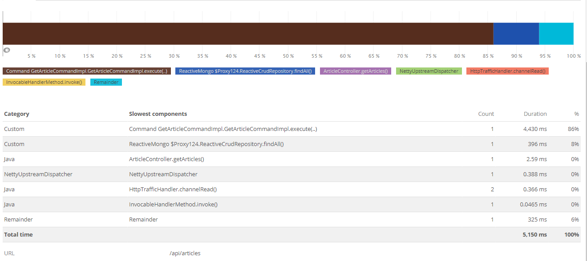

# Reactor New Relic Instrumentation

A plugin to enable new relic instrumentation in Spring Boot 2 Webflux App.

List of supported modules:
- command-plugin: anything that implement `Command` interface.
- spring-reactive-mongo: ReactiveMongoRepository all inherited method and custom query.

Planned future modules:
- Reactive relational DB (via R2DBC)
- Reactive elastic search
- Reactive redis

## How to use

1. Include the library in your POM.

    ```
    <dependency>
        <groupId>com.blibli.oss</groupId>
        <artifactId>blibli-backend-framework-newrelic</artifactId>
    </dependency>
    ```

2. Add `@EnableNewRelicReactorInstrumentation` annotation to enable instrumentation in the main app.
    
    ```java
    @SpringBootApplication
    @EnableNewRelicReactorInstrumentation
    public class MySpringbootWebfluxApplication {
    
        public static void main(String[] args) {
          SpringApplication.run(MySpringbootWebfluxApplication.class, args);
        }
    
    }
    ```

And viola! See your app instrumented in New Relic.



## How it works

1. Inject new relic Token and Transaction for every web request in reactor Context. See `NewRelicTokenInjectorFilter` filter class.
2. When code is entering a known module (targeted by our AOP pointcut), then append additional reactor operator to time those method execution using New Relic `Transaction.startSegment()`.

## Known issues

- Command timing report will include ReactiveMongoRepository timing.
- There are still "Remainder" time on New Relic report. It may caused by the time the thread waiting until executed by Spring thread pool because of traffic congestion.
